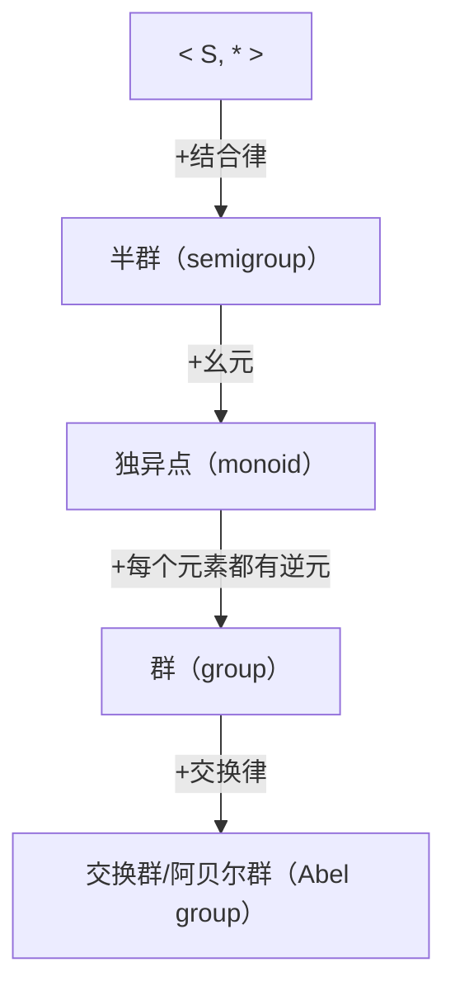

# Lec 13: 代数结构、同态映射、形式语言
## 1. 代数结构（algebraic structure）
## 1. 1 运算（operator）
### 1. 1. 1 定义
* 运算是 $S^n$ 到 $S$ 的一个函数，称为$n$元运算
* 常用 $*$ 表示二元运算，$*(x,y)$ 常记作 $x*y$
* 常用 $∆$ 表示一元运算
### 1. 1. 2 基本性质
* 普遍性：$S$ 中的所有元素都可以参加运算
    - $∀x\,∀y\,∃z \quad (x ∗ y = z)$
* 单值性：相同元素运算结果相同且唯一
    - $∀x\,∀y\,∀x'\,∀y' \quad ((x=x'∧y=y')→(x∗y=x'∗y'))$
* 封闭性：任何元素参加运算的结果也是 $$S$ 中的元素
    - $∀x\,∀y\,∃z \quad (x ∗ y = z → z ∈ S)$
## 1. 2 代数结构
### 1. 2. 1 定义
* 装备了一个及以上的运算的非空集合
### 1. 2. 2 特殊元
1. **幺元（identity element）**
    - 定义
        + 代数结构 $<S,*>$ 中满足 $∀x \quad (x ∗ e = e ∗ x = x)$ 的元素e
        + 若仅满足$∀x \quad (x ∗ e = x)$，则称作右幺元
        + 若仅满足$∀x \quad(e ∗ x = x)$，则称作左幺元
    - 性质
        + 一般情况下，左右幺元可能是不同元素，也可能有多个
        + 若幺元存在，则必唯一，且同时为左右幺元
2. **零元（zero element）**
    - 定义
        + 代数结构 $<S,*>$ 中满足$∀x \quad (x ∗ o = o ∗ x = o)$ 的元素o
        + 若仅满足$∀x \quad (x ∗ o = o)$，则称作右零元
        + 若仅满足$∀x \quad (o ∗ x = o)$，则称作左零元
    - 性质
        + 一般情况下，左右零元可能是不同元素，也可能有多个
        + 若零元存在，则必唯一，且同时为左右零元
3. **逆元（inverse element）**
    - 定义
        + 对于代数结构$<S,*>$中的幺元e，若 $x*y = e$ ，则称x为y的左逆元，y为x的右逆元
        + 若 $x*y=y*x=e$ ，则 x,y互称逆元
        + $x$ 的逆元通常记作 $x^{-1}$
        + 如果运算被称作“加法”的话，$x$ 的逆元可以记作 $–x$
    - 性质
        + 多于1个元素的载体集上的零元没有逆元
        + 满足结合律的代数结构中，逆元是唯一的
4. **可约（cancelable）元素**
    - 定义
        + 左可约：对于 $<S,*>$ ，$∀x\,∀y \quad a ∗ x = a ∗ y ⊨ x = y$
        + 右可约：对于 $<S,*>$ ，$∀x\,∀y \quad x ∗ a = y ∗ a ⊨ x = y$
    - 性质
        + 满足结合律的代数结构中，有逆元的元素是可约的
### 1. 2. 3 分类
1. **基本类型**

2. **衍生类型**
    * **环（ring）**
        + $<R,+,*>$ 有两个二元运算
        + $<R,+>$ 是阿贝尔群
        + $<R,*>$ 是半群
        + 对 $+$ 可分配
    * **域（field）**
        + $<F,+,*>$ 有两个二元运算
        + $<F,+,*>$ 是环
        + $<F - \{o\},*>$ 为阿贝尔群

#### 1. 2. 4 同余关系（congruence relation）
* 代数结构 $<S,∆,∗>$ 中，S上的一个等价关系 ～ ，如果满足：
    * a～b 蕴含 ∆a～ ∆b，则称～是S上关于一元运算 $∆$ 的同余关系
    * a～b, c～d 蕴含 a*c～ b*d，则称～是S上关于二元运算*的同余关系
* 同余关系体现了运算保持等价类的性质
* 等价类$[x]～$称作同余类
## 2. 同态映射（homomorphism）
### 2. 1 同构
* 定义：存在 $S → S'$ 的一一映射 $h$，使得 $h(x ∗ y) = h (x) ∘ h(y)$，其中 $*$ 是 $S$ 上的运算，$∘$ 是 $S'$ 上的运算
### 2. 2 同态映射
* 定义
    + 对于代数结构 $<S,∆,\#>$ 和 $<S',∆',\#'>$ ，若有函数 $h: S → S'$，对 $S$ 中任意元素 $a,b$ 满足 $ h (∆(a)) = ∆'(h(a)) \, , \,  h (a\#b) = h (a) \#'(h(b))$ ，则称函数h为代数结构 $S$ 到 $S'$ 的同态映射
* 分类
    + 若h是**单射函数**，则称作**单一同态**
    + 若h是**满射函数**，则称作**满同态**
    + 若h是**双射函数**，则称作**同构映射（isomorphism）**

## 3. 形式语言
### 3. 1 基本概念
* 形式语言：按照一定规律构成的句子和符号串的有限或者无限集合
* 字符：有限集合V中的元素
* 字符串：由V中字符相连而成的有限序列
* 空串：不含任何字符的字符串，记作 $ \epsilon $  
* 长度：字符串所包含的字符个数，记作 $|s|$
* 幂：$s^n$ 表示s自身连接n次，其中 $s^0= \epsilon $
* 包括空串的V上的字符串全体记做 $V^*$
### 3. 2 字符串集合的运算
* 乘积：$AB=\{st |	s ∈ A ∧ t ∈ B\}$
* 幂运算：$A^0={ \epsilon }$， $A^n=A^{n-1}A=AA^{n-1}$
* 闭包：$A^*=A^0∪ A^1 ∪ A^2∪ A^3∪ ⋯$
* 正闭包：$A^+=A^1 ∪ A^2∪ A^3∪ ⋯=A^*-{ \epsilon }$
### 3. 3 正则表达式（Regular Expression）
1. **归纳定义**
    * RE1: $ \epsilon $ 是正则式，对应正则集 $ \{\epsilon\} $
    * RE2: $x ∈ V$，$x$ 是正则式，对应正则集 $\{x\}$
    * RE3: 如果 $a$ , $b$ 是正则式，则 $ab$ 是正则式，对应正则集 $AB$（字符串集合乘积）
    * RE4: 如果 $a$ , $b$ 是正则式，则 $(a|b)$ 是正则式，对应正则集 $A∪B$
    * RE5: 如果 $a$ 是正则式，则 $(a)^*$ 是正则式，对应正则集 $A^*$
2. **正则表达式对应字符串集合**
    * $V$ 上的正则表达式对应和描述了 $V^*$ 的一个子集（正则子集）